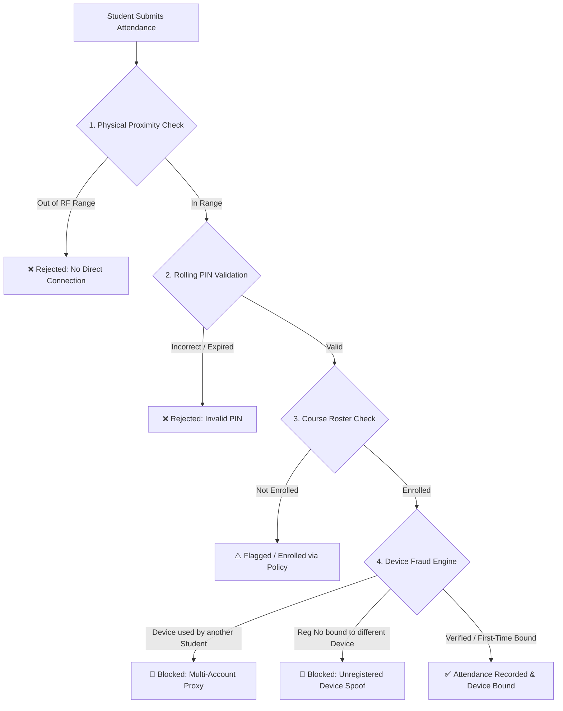
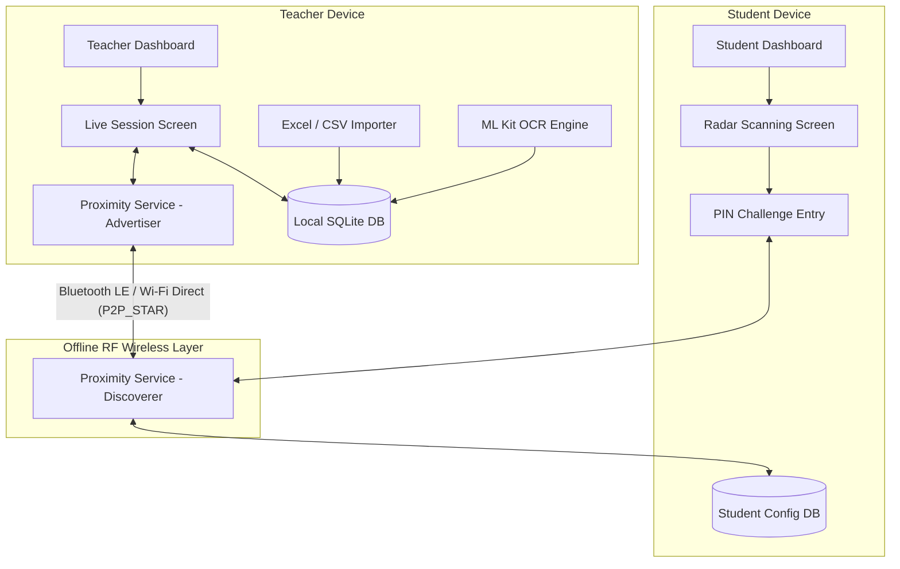
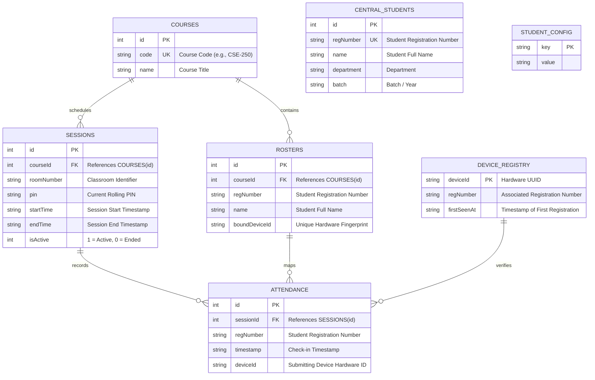

#  Smart Proximity Attendance System

[](https://flutter.dev/)
[](https://dart.dev/)
[](https://developer.android.com/)
[](https://www.sqlite.org/)
[](https://developers.google.com/ml-kit)
[](https://opensource.org/licenses/MIT)

An enterprise-grade, offline-first, peer-to-peer (P2P) proximity-based attendance automation system engineered with **Flutter**, **Google Nearby Connections API**, **Google ML Kit OCR**, and **SQLite**.

Designed specifically for universities and educational institutions, this system replaces traditional roll calls, paper sign-in sheets, and expensive biometric hardware. It guarantees **100% offline functionality** while enforcing impenetrable **anti-proxy security** through multi-layered radio frequency proximity, rolling cryptographic PINs, and hardware device fingerprint binding.

---

##  Table of Contents

- [Executive Summary & Problem Statement](#-executive-summary--problem-statement)
- [Core Highlights & Architecture](#-core-highlights--architecture)
- [System Features](#-system-features)
  - [👨‍🏫 Instructor / Teacher Module](#-instructor--teacher-module)
  - [👨‍🎓 Student Module](#-student-module)
  - [🛡️ Anti-Proxy & Fraud Prevention Engine](#️-anti-proxy--fraud-prevention-engine)
  - [📊 Analytics, Export & Reporting](#-analytics-export--reporting)
- [System Architecture & Data Flow](#-system-architecture--data-flow)
- [Relational Database Schema](#-relational-database-schema)
- [Technology Stack](#-technology-stack)
- [Project Directory Structure](#-project-directory-structure)
- [Prerequisites & Permissions](#-prerequisites--permissions)
- [Installation & Build Guide](#-installation--build-guide)
- [Release Build & ProGuard / R8 Configuration](#-release-build--proguard--r8-configuration)
- [Operational Workflow](#-operational-workflow)
- [Testing & Quality Assurance](#-testing--quality-assurance)
- [Project Contributors & Academic Credits](#-project-contributors--academic-credits)
- [License](#-license)

---

##  Overview

### The Problem with Traditional Attendance
1. **Proxy Attendance**: Students sign attendance rosters for absent friends or share remote links/static QR codes outside class.
2. **Time Inefficiency**: Calling names consumes 10–15 minutes of every lecture.
3. **Biometric & Cloud Bottlenecks**: Fingerprint and RFID scanners cause long queues, require maintenance, and fail when campus Wi-Fi or cloud servers disconnect.
4. **Network Instability**: Basement lecture halls and auditorium classrooms often lack cellular connectivity and stable Wi-Fi.

### The Solution: Smart Proximity Attendance
**Smart Proximity Attendance** turns smartphones into secure, decentralized attendance hubs:
- **Zero Internet Requirement**: Operates completely over local RF signals (Bluetooth Low Energy and Wi-Fi Direct).
- **Physical Presence Verification**: Students must be within physical RF broadcast range (5–15 meters) of the instructor's device.
- **Sub-Second Automated Processing**: Attendance verification and handshake take less than 200ms per student.
- **Hardware-Level Accountability**: Each student's identity is bound to their physical device UUID, eliminating multi-account proxy attempts.

---

##  Key Features

###  Instructor / Teacher Module
- **Course & Roster Management**:
  - Create and manage academic courses.
  - Bulk import student rosters via CSV (`Registration Number`, `Student Name`).
  - Add or edit student records manually.
- **Live Attendance Broadcast**:
  - Start an active session advertising the course ID using `P2P_STAR` topology.
  - **Dynamic Rolling PIN**: 6-digit rolling PIN refreshed every 30 seconds with visual countdown timer.
  - If a student tries to give attendance using a different device, the attendance will fail. The system will display:
“This registration is bound to a different device. Please contact your teacher.”
  - **Real-Time Live Counter**: Instant UI updates showing enrolled vs. present students with animated progress indicators.
  - Automatic connection handshake, payload evaluation, and confirmation dispatch.
- **Session History & Reports**:
  - View all previous attendance sessions with room number, date, and attendance count.
  - Detailed student check-in timestamps.
  - **CSV Export & Share**: Generate formatted CSV attendance sheets and share via system dialogs (WhatsApp, Email, Drive, etc.).

#### 1. Central Control Dashboard
- **Real-Time Overview**: Live metrics displaying active courses, total students registered, conducted sessions, and historical logs.
- **Session State Persistence**: Automatically restores and maintains active broadcast sessions across screen navigation and app restarts.
- **Quick-Action Hub**: Single-tap shortcuts to launch classes, manage rosters, scan paper documents, and view analytics.

#### 2. Course & Central Roster Management
- **Course Administration**: Create, edit, and organize courses by Course Code (e.g., `CSE-250`) and Title.
- **Multi-Source Student Ingestion**:
  - **Excel Import (`.xlsx`, `.xls`)**: Direct spreadsheet parsing with automatic column mapping.
  - **CSV Import (`.csv`)**: High-speed batch processing for institutional CSV exports.
  - **ML Kit Document OCR Scanner**: Live camera capture or image selection that uses on-device machine learning text recognition to extract student IDs from handwritten or printed physical attendance sheets.
  - **Interactive OCR Review**: Crop, filter, edit, and bulk-select recognized registration numbers before importing.
  - **Session-Based Auto-Enrollment**: Automatically enroll students who attended a live broadcast into the course roster with a single tap.
  - **Manual Entry**: Add individual students on demand.
- **Hardware Binding Management**: Inspect bound device IDs and reset device locks when a student legitimately switches phones.

#### 3. Live Attendance Broadcast & Real-Time Monitoring
- **P2P Star Topology Advertising**: Hosts an isolated local wireless mesh network advertising the unique session identifier.
- **Dynamic 6-Digit Rolling PIN**: Rotates every 30 seconds with a real-time circular countdown indicator. Includes a 1-cycle grace tolerance to prevent false rejections caused by network packet transmission delay.
- **Live Counter & Stream**: Real-time counter showing `Present / Enrolled` counts and an animated progress bar.
- **Live Attendance Search & Verification**: Instant search bar to quickly verify check-in status for any student ID.
- **Early Session Finalization**: Stop broadcasting at any time to freeze attendance logs and immediately transition to the report view.

---

##  Anti-Proxy & Fraud Prevention

#### 1. Profile Setup & One-Time Identity Binding
- **Fast Registration**: Store Student Full Name, Registration Number / Roll ID, Department, and Academic Batch.
- **Device Fingerprint Binding**: Binds the student profile to the physical device's hardware UUID on first check-in.

#### 2. Radar Proximity Discovery
- **Animated Radar Scanning Interface**: Real-time visual feedback scanning for nearby active teacher broadcasts.
- **Zero Configuration**: Eliminates manual Bluetooth pairing, network SSID discovery, or URL typing.
- **Line-of-Sight PIN Challenge**: Prompts the student to enter the 6-digit rolling PIN displayed on the classroom screen.
- **Instant Result Feedback**: Instant modal confirmation displaying session timestamp, room number, and verification status.

---

### 🛡️ Anti-Proxy & Fraud Prevention Engine

The system enforces a multi-tier defense architecture preventing proxy attendance:



1. **Physical Layer Boundary**: Enforced via Bluetooth LE & Wi-Fi Direct radio ranges. Signals cannot be routed over the internet or spoofed from dorms/remote locations.
2. **Time-Synchronized Rolling PIN**: A 6-digit PIN regenerated every 30 seconds requires visual line-of-sight to the classroom display.
3. **Hardware Fingerprint Locking (`device_registry`)**: Maps unique Android hardware IDs (`androidInfo.id`) to registration numbers. Prevents one student from submitting attendance for absent classmates from the same device.
4. **Duplicate Submission Protection**: Database-level unique constraints and active session filtering prevent duplicate submissions.

---

## 🏗 System Architecture



---

##  Database Schema

The app uses an embedded SQLite database (`attendance_system_v2.db`) optimized with indexes and foreign keys:



---

##  Tech Stack

| Domain | Technology / Library | Version | Purpose |
| :--- | :--- | :--- | :--- |
| **Core Framework** | [Flutter](https://flutter.dev/) | `SDK ^3.12.2` | High-performance cross-platform UI engine |
| **Programming Language** | [Dart](https://dart.dev/) | `3.x` | Strongly-typed client and business logic |
| **P2P Wireless Networking** | [Google Nearby Connections](https://developers.google.com/nearby/connections/overview) | `^4.3.0` | Offline Bluetooth LE & Wi-Fi Direct communication |
| **Embedded Database** | [sqflite](https://pub.dev/packages/sqflite) | `^2.4.3` | Local relational SQLite database engine |
| **Machine Learning / OCR** | [google_mlkit_text_recognition](https://pub.dev/packages/google_mlkit_text_recognition) | `^0.16.0` | On-device optical character recognition for paper rosters |
| **Image Ingestion** | [image_picker](https://pub.dev/packages/image_picker) | `^1.2.3` | Camera and gallery image capture for OCR |
| **Spreadsheet Processing** | [excel](https://pub.dev/packages/excel) | `^4.0.6` | Reading and writing `.xlsx` / `.xls` spreadsheets |
| **CSV Engine** | [csv](https://pub.dev/packages/csv) | `^8.0.0` | Delimited text parsing and generation |
| **Hardware Identification** | [device_info_plus](https://pub.dev/packages/device_info_plus) | `11.5.0` | Secure hardware fingerprinting and UUID extraction |
| **Runtime Permissions** | [permission_handler](https://pub.dev/packages/permission_handler) | `11.3.1` | Android dynamic permission lifecycle management |
| **System Sharing** | [share_plus](https://pub.dev/packages/share_plus) | `10.1.3` | Export sharing to external Android applications |
| **Document Selection** | [file_picker](https://pub.dev/packages/file_picker) | `11.0.3` | Native file picker dialogs for CSV and Excel files |
| **Localization & Date/Time** | [intl](https://pub.dev/packages/intl) | `^0.20.3` | Timestamp formatting and temporal operations |

---

##  Project Directory Structure

```text
Project_250/
├── android/                               # Native Android configuration
│   ├── app/
│   │   ├── build.gradle.kts               # Android application build configuration
│   │   ├── proguard-rules.pro             # ProGuard / R8 keep & suppression rules
│   │   └── src/main/AndroidManifest.xml   # Permissions and hardware feature declarations
│   ├── build.gradle.kts                   # Top-level Gradle configuration
│   └── settings.gradle.kts                # Plugin and repository configurations
├── lib/
│   ├── main.dart                          # App entry point, routing & theme initialization
│   ├── screens/                           # UI presentation layer
│   │   ├── central_students_screen.dart   # Global student registry & management
│   │   ├── course_management_screen.dart  # Course creation, update & deletion
│   │   ├── course_report_screen.dart      # Course-wide attendance metrics & Excel export
│   │   ├── enroll_by_session_dialog.dart  # Auto-enrollment from active sessions
│   │   ├── live_session_screen.dart       # Broadcast control, rolling PIN & live stream
│   │   ├── ocr_scan_review_screen.dart    # OCR bounding box confirmation & ID parsing
│   │   ├── report_screen.dart             # Per-session attendance reports & CSV export
│   │   ├── role_selection_screen.dart     # Role selector (Teacher vs. Student)
│   │   ├── roster_management_screen.dart  # Course roster view, CSV/Excel/OCR imports
│   │   ├── scanning_screen.dart           # Radar discovery & PIN challenge modal
│   │   ├── student_dashboard.dart         # Student home screen & scan trigger
│   │   ├── student_login_screen.dart      # Student registration & profile login
│   │   └── teacher_dashboard.dart         # Teacher control panel & active session card
│   └── services/                          # Core business logic and data access
│       ├── database_helper.dart           # SQLite schema, migrations, anti-fraud logic
│       ├── proximity_service.dart         # Nearby Connections advertising & discovery
│       └── student_import_service.dart    # Excel, CSV & OCR parsing algorithms
├── packages/
│   └── nearby_connections/                # Local Nearby Connections plugin wrapper
├── test/
│   └── student_import_test.dart           # Unit tests for import & parsing logic
├── pubspec.yaml                           # Project dependencies and asset definitions
└── README.md                              # Complete project documentation
```

---

##  Prerequisites & Permissions

### Hardware & Platform Requirements
- **OS**: Android 5.0 (API Level 21) or higher *(Android 12+ recommended)*.
- **Hardware**: Bluetooth Low Energy (BLE), Wi-Fi Direct hardware support, and Location Services.
- **Testing**: Requires **physical Android devices** (Nearby Connections cannot communicate over Android emulators).

### Runtime Android Permissions
The application automatically requests all required runtime permissions on first launch:
- `ACCESS_FINE_LOCATION` / `ACCESS_COARSE_LOCATION` *(BLE beacon scanning on Android)*
- `BLUETOOTH_SCAN`, `BLUETOOTH_ADVERTISE`, `BLUETOOTH_CONNECT` *(Android 12+ / API 31+)*
- `NEARBY_WIFI_DEVICES` *(Android 13+ / API 33+)*
- `CAMERA` *(For Google ML Kit OCR scanning)*
- `READ_EXTERNAL_STORAGE` / `READ_MEDIA_IMAGES` *(For document and image selection)*

---

##  Getting Started

### 1. Clone the Repository
```bash
git clone https://github.com/borno18/Android-Project.git
cd Android-Project
```

### 2. Fetch Dependencies
```bash
flutter pub get
```

### 3. Run in Debug Mode
Connect an Android device with USB debugging enabled:
```bash
flutter run
```

---

## 📦 Release Build & ProGuard / R8 Configuration

To build an optimized, production-ready release APK:

### Student Workflow:
1. Launch the app and select **Student**.
2. Enter your **Registration Number** (saved automatically for future sessions).
3. Tap **Join Live Class / Scan**.
4. The radar interface will discover the instructor's broadcast.
5. Enter the **6-digit PIN** displayed on the classroom screen.
6. Receive instantaneous confirmation upon successful check-in.

---

##  Export & Reporting

Attendance reports can be exported in standardized `.csv` format:

```csv
#,Registration Number,Name,Timestamp
1,2021331001,John Doe,2026-08-15 10:15:32
2,2021331002,Jane Smith,2026-08-15 10:15:45
```

The APK will be generated at:
```text
build/app/outputs/flutter-apk/app-release.apk
```

### ProGuard / R8 Rules
The project includes a pre-configured [android/app/proguard-rules.pro](file:///c:/Users/joydi/AndroidStudioProjects/Project_250/android/app/proguard-rules.pro) that handles Google ML Kit optional script recognizers and Google Play Services classes during release minification:

```proguard
# ML Kit Text Recognition suppressions & keep rules
-dontwarn com.google.mlkit.vision.text.**
-dontwarn com.google.mlkit.vision.common.**
-keep class com.google.mlkit.vision.text.** { *; }
-keep class com.google.mlkit.vision.common.** { *; }

# Google Play Services
-dontwarn com.google.android.gms.**
-keep class com.google.android.gms.** { *; }
```

---

##  Authors & Acknowledgments

- **Developers**: Mst. Myful (2023831010), Samia Rahman(2023831046), Joydip Majumdar Borno(2023831004)
- **Organization**: Academic Project / Android Development

---

## 📄 License

This project is licensed under the **MIT License** — see the [LICENSE](LICENSE) file for full details.
