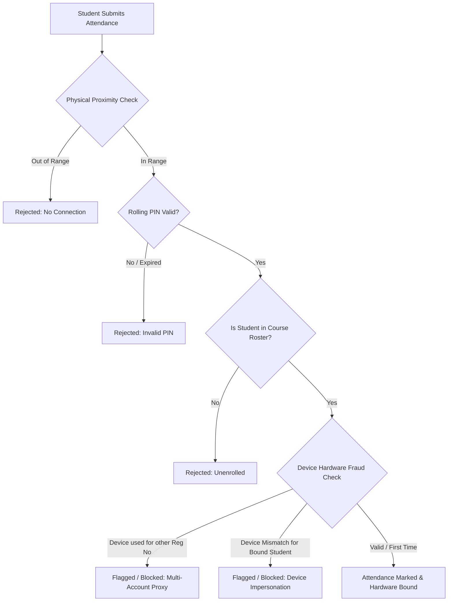
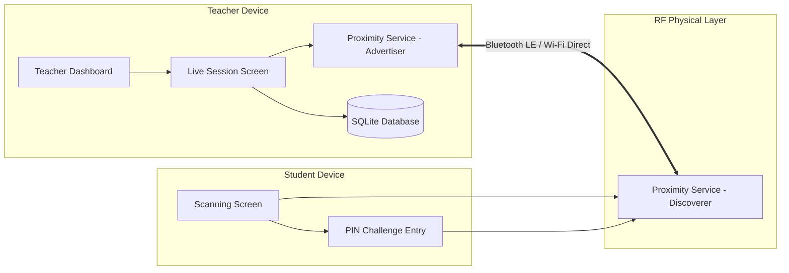
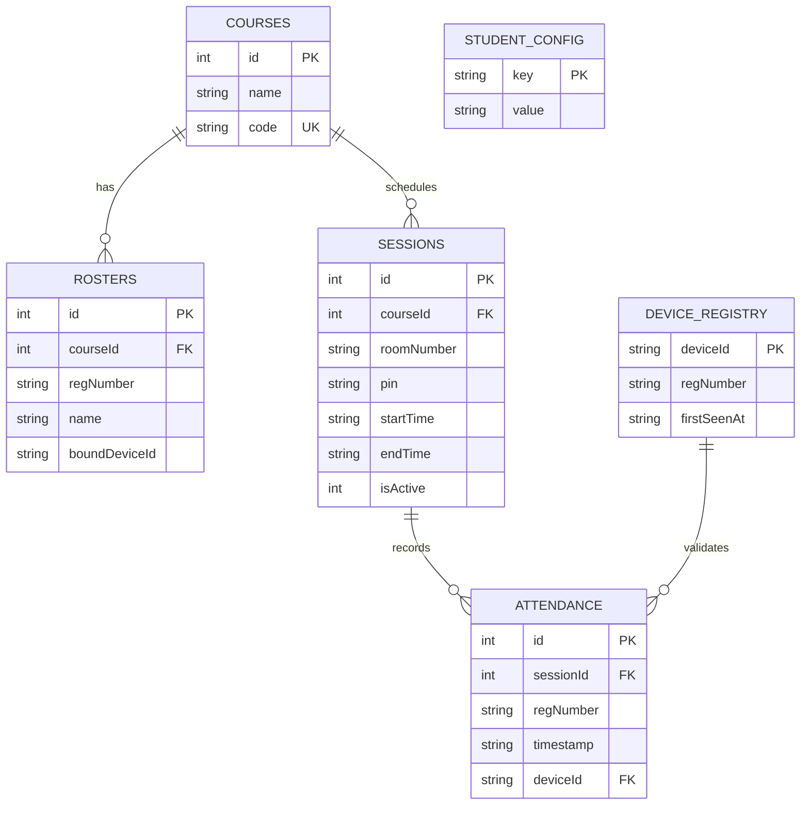

# 📡 Smart Proximity Attendance System

[](https://flutter.dev/)
[](https://dart.dev/)
[](https://developer.android.com/)
[](https://www.sqlite.org/)
[](https://opensource.org/licenses/MIT)

An offline, peer-to-peer (P2P) proximity-based automated attendance management application built with **Flutter**, **Google Nearby Connections API**, and **SQLite**. Designed for educational institutions, it eliminates manual roll calls and prevents proxy attendance through multi-layered hardware binding and rolling cryptographic PIN verification—**100% offline without requiring internet access**.

---

## 📑 Table of Contents

- [Overview](#-overview)
- [Key Features](#-key-features)
- [Anti-Proxy & Fraud Prevention](#-anti-proxy--fraud-prevention)
- [System Architecture](#-system-architecture)
- [Database Schema](#-database-schema)
- [Tech Stack](#-tech-stack)
- [Project Directory Structure](#-project-directory-structure)
- [Prerequisites & Permissions](#-prerequisites--permissions)
- [Getting Started](#-getting-started)
- [Application Flow & Usage](#-application-flow--usage)
- [Export & Reporting](#-export--reporting)
- [Contributing](#-contributing)
- [License](#-license)

---

## 🌟 Overview

Traditional attendance systems suffer from proxy marking (students signing in for absent peers), slow manual paper roll-calls, or high infrastructure costs for biometric hardware.

**Smart Proximity Attendance** solves these challenges by leveraging local RF hardware (Bluetooth Low Energy and Wi-Fi Direct) directly between student and instructor smartphones:
- **Zero Internet Requirement**: Operates entirely over local P2P mesh/star topologies.
- **Physical Proximity Verification**: Students must be within physical broadcast range of the classroom instructor.
- **Automated Verification**: Fast handshake and validation in milliseconds.

---

## 🚀 Key Features

### 👨‍🏫 Instructor / Teacher Module
- **Course & Roster Management**:
  - Create and manage academic courses.
  - Bulk import student rosters via CSV (`Registration Number`, `Student Name`).
  - Add or edit student records manually.
- **Live Attendance Broadcast**:
  - Start an active session advertising the course ID using `P2P_STAR` topology.
  - **Dynamic Rolling PIN**: 6-digit rolling PIN refreshed every 30 seconds with visual countdown timer.
  - **Real-Time Live Counter**: Instant UI updates showing enrolled vs. present students with animated progress indicators.
  - Automatic connection handshake, payload evaluation, and confirmation dispatch.
- **Session History & Reports**:
  - View all previous attendance sessions with room number, date, and attendance count.
  - Detailed student check-in timestamps.
  - **CSV Export & Share**: Generate formatted CSV attendance sheets and share via system dialogs (WhatsApp, Email, Drive, etc.).

### 🎓 Student Module
- **One-Time Identity Binding**:
  - Store student registration number locally.
- **Radar Proximity Discovery**:
  - Animated radar scanning interface that automatically detects instructor broadcasts in range.
- **PIN Challenge & Verification**:
  - Prompts for the current classroom rolling PIN upon detecting the session.
  - Sends encrypted JSON payload containing `regNumber`, `deviceId`, and `pin`.
  - Immediate visual feedback (Success / Fraud Alert / Incorrect PIN / Roster Warning).

---

## 🔒 Anti-Proxy & Fraud Prevention

The system implements a three-tier fraud prevention model:



1. **Physical Proximity Verification**: Enforced at the radio physical layer (BLE / Wi-Fi Direct). Signals cannot be received remotely over the internet.
2. **Rolling Time-Based PIN**: A 6-digit PIN regenerated every 30 seconds (with a 1-cycle grace window) projected on the classroom screen prevents remote PIN sharing.
3. **Hardware Device Binding (`device_registry`)**: Each student's physical device UUID (`androidInfo.id` / `identifierForVendor`) is mapped to their registration number. If a student tries to submit for an absent friend from the same phone, the system rejects it as device fraud.

---

## 🏗 System Architecture



---

## 🗄 Database Schema

The app uses an embedded relational SQLite database (`attendance_system_v2.db`) structured as follows:



---

## 💻 Tech Stack

| Category | Technology | Purpose |
| :--- | :--- | :--- |
| **Framework** | [Flutter](https://flutter.dev/) (Dart 3.x) | Cross-platform mobile UI and logic |
| **P2P Networking** | [Google Nearby Connections](https://developers.google.com/nearby/connections/overview) | Local Bluetooth/Wi-Fi Direct communications |
| **Database** | [sqflite](https://pub.dev/packages/sqflite) | Local SQLite persistence & relational queries |
| **Device Identification** | [device_info_plus](https://pub.dev/packages/device_info_plus) | Unique hardware fingerprint retrieval |
| **Permissions** | [permission_handler](https://pub.dev/packages/permission_handler) | Dynamic runtime permission requests |
| **File I/O & Export** | [csv](https://pub.dev/packages/csv), [path_provider](https://pub.dev/packages/path_provider) | CSV generation and local storage access |
| **Sharing** | [share_plus](https://pub.dev/packages/share_plus) | Export sharing to external apps |
| **File Picker** | [file_picker](https://pub.dev/packages/file_picker) | CSV roster file selection |
| **Date & Time** | [intl](https://pub.dev/packages/intl) | Timestamps and locale-aware formatting |

---

## 📂 Project Directory Structure

```text
Project_250/
├── android/                        # Native Android configuration & manifests
├── ios/                            # iOS runner & entitlements
├── lib/                            # Application Dart source code
│   ├── main.dart                   # Application entry point & route definitions
│   ├── screens/                    # User interface screens
│   │   ├── role_selection_screen.dart     # Select Teacher / Student role
│   │   ├── teacher_dashboard.dart         # Instructor home & session Launcher
│   │   ├── course_management_screen.dart  # Course creation & overview
│   │   ├── roster_management_screen.dart  # CSV roster import & student binding
│   │   ├── live_session_screen.dart       # Live broadcast, rolling PIN & counter
│   │   ├── report_screen.dart             # Session reports & CSV export
│   │   ├── student_login_screen.dart      # Student registration / login
│   │   ├── student_dashboard.dart         # Student landing & scanning trigger
│   │   └── scanning_screen.dart           # Radar discovery & PIN submission
│   └── services/                   # Core business logic & database services
│       ├── database_helper.dart           # SQLite schemas, CRUD & anti-fraud logic
│       └── proximity_service.dart         # Nearby Connections advertising/discovery
├── packages/                       # Local plugin packages & overrides
│   └── nearby_connections/         # Nearby Connections Flutter plugin wrapper
├── pubspec.yaml                    # Flutter dependencies & metadata
└── README.md                       # Project documentation
```

---

## ⚙️ Prerequisites & Permissions

### Android Requirements
- **Minimum SDK**: API Level 21 (Android 5.0 Lollipop)
- **Target SDK**: API Level 34 (Android 14)
- **Hardware**: Bluetooth LE, Wi-Fi Direct, and Location Services

### Required Permissions
The app dynamically requests:
- `ACCESS_FINE_LOCATION` / `ACCESS_COARSE_LOCATION` (Required for BLE beacon discovery on Android)
- `BLUETOOTH_SCAN`, `BLUETOOTH_ADVERTISE`, `BLUETOOTH_CONNECT` (Android 12+)
- `NEARBY_WIFI_DEVICES` (Android 13+)
- `READ_EXTERNAL_STORAGE` / Storage access for CSV import

---

## 🚀 Getting Started

### 1. Clone the Repository
```bash
git clone https://github.com/borno18/Android-Project.git
cd Android-Project
```

### 2. Install Dependencies
```bash
flutter pub get
```

### 3. Run the App
Connect your Android device via USB debugging and run:
```bash
flutter run
```

> **Note**: Because the Nearby Connections API relies on physical Bluetooth and Wi-Fi hardware, testing must be conducted on **physical devices** (two devices recommended: one for Teacher, one for Student).

---

## 📱 Application Flow & Usage

### Instructor Workflow:
1. Launch the app and select **Teacher**.
2. Create a course (e.g., `CSE-250: Mobile Computing`).
3. Click **Roster** to upload a CSV file with student registration numbers or add students manually.
4. Tap **Start Session**, enter the room number, and press **Launch**.
5. Display the **6-digit Rolling PIN** to students in the classroom.
6. Observe the live attendee counter as students check in.
7. Tap **End Session** to finalize records and view/export the session report.

### Student Workflow:
1. Launch the app and select **Student**.
2. Enter your **Registration Number** (saved automatically for future sessions).
3. Tap **Join Live Class / Scan**.
4. The radar interface will discover the instructor's broadcast.
5. Enter the **6-digit PIN** displayed on the classroom screen.
6. Receive instantaneous confirmation upon successful check-in.

---

## 📊 Export & Reporting

Attendance reports can be exported in standardized `.csv` format:

```csv
#,Registration Number,Name,Timestamp
1,2021331001,John Doe,2026-08-15 10:15:32
2,2021331002,Jane Smith,2026-08-15 10:15:45
```

Reports can be shared directly to institutional portals, spreadsheets, or messaging platforms with a single click.

---

## 👥 Authors & Acknowledgments

- **Developers**: Mst. Myful (2023831010), Samia Rahman(2023831046), Joydip Majumdar Borno(2023831004)
- **Organization**: Academic Project / Android Development

---

## 📄 License

This project is licensed under the [MIT License](LICENSE).
